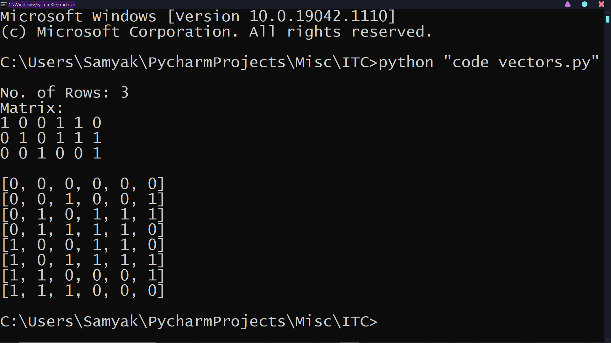

# Code Vectors

While studying for [Information Theory and Coding](https://en.wikipedia.org/wiki/Information_theory) (ITC), a subject in our 5th sem of college, there comes a question to find out the code vectors (words) of a [Linear Block Code](https://en.wikipedia.org/wiki/Linear_code (LBC)) using [Generator matrix](https://en.wikipedia.org/wiki/Generator_matrix) which I thought of implementing.


## Installing the Dependencies

After downloading this project to your PC, open the project folder, there, open your [command-line interpreter](https://en.wikipedia.org/wiki/List_of_command-line_interpreters#:~:text=In%20computing%2C%20a%20command-line%20interpreter%2C%20or%20command%20language%20interpreter%2C%20is%20a%20blanket%20term%20for%20a%20certain%20class%20of%20programs%20designed%20to%20read%20lines%20of%20text%20entered%20by%20a%20user%2C%20thus%20implementing%20a%20command-line%20interface.) (e.g. Command Prompt for Windows), and run the following:
```
pip install -r requirements.txt
```


## I/O Format

#### INPUT: (No. of columns, No. of rows, Linear Block Code)
No. of Rows: 6 <br />
Matrix: <br />
1 0 0 1 1 0 <br />
0 1 0 1 1 1 <br />
0 0 1 0 0 1 <br />

#### OUTPUT: (Code Vectors)
[0, 0, 0, 0, 0, 0] <br />
[0, 0, 1, 0, 0, 1] <br />
[0, 1, 0, 1, 1, 1] <br />
[0, 1, 1, 1, 1, 0] <br />
[1, 0, 0, 1, 1, 0] <br />
[1, 0, 1, 1, 1, 1] <br />
[1, 1, 0, 0, 0, 1] <br />
[1, 1, 1, 0, 0, 0] <br />


## Screenshot


